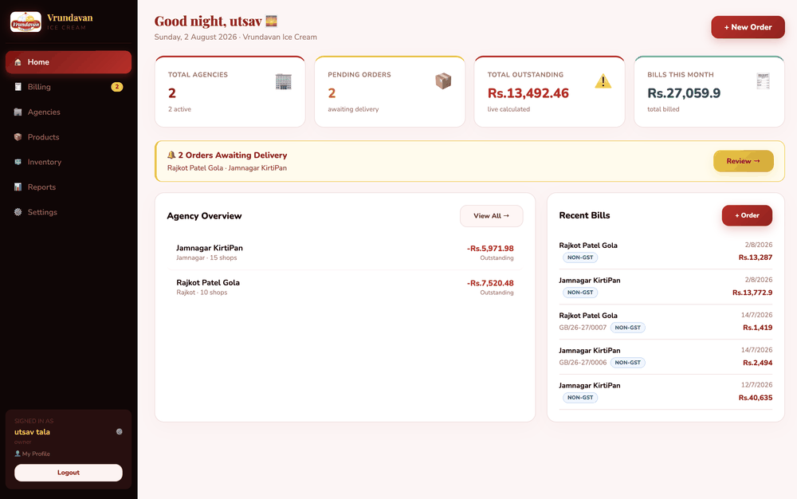

# ICEPRO ERP

**Full-stack Ice Cream Distribution & Billing Management System** for _Vrundavan Ice Cream / Vrundavan Milk Products_ — agency ledgers, GST / Non-GST invoicing, payment tracking, and analytics in one place.


---

## 🔗 Live Demo

**[Live Demo](https://icepro-eight.vercel.app/)** <!-- TODO: replace with your real Vercel URL -->

> A preview/demo login may be provided on request. <!-- TODO: add demo credentials here if you want to share them, or remove this line -->

---

## 📌 Overview

ICEPRO ERP replaces a spreadsheet-and-memory workflow for a regional ice-cream distributor with a real web application: create agencies, generate GST and Non-GST invoices with auto-incrementing invoice numbers, record payments against outstanding balances, and read the whole business at a glance from a dashboard and analytics reports.

It is used by the business **owner** and **managers**, and was built as a placement/portfolio-grade full-stack project — deliberately demonstrating production backend patterns (layered controller → service architecture, JWT auth, RBAC, request validation, rate limiting, atomic MongoDB transactions) rather than a toy CRUD app. It began life on Firebase and was migrated to a self-owned MERN backend.

---

## ✨ Features

### Authentication & Security
- **JWT authentication** — access token signed with `jsonwebtoken`, sent as a `Bearer` header.
- **Password hashing** — `bcryptjs` (salted, pre-save hook; passwords never returned in queries).
- **Google Sign-In** — verified server-side via `google-auth-library` (`/auth/google`), plus a profile-autofill endpoint for signup.
- **Multi-step signup gate** — shared signup secret + live email/username availability checks.
- **Email verification** — token-based verify-and-set-password flow via `nodemailer` (Gmail OAuth2 / App Password, with an Ethereal sandbox fallback when no email creds are set).
- **Account lockout** — configurable max login attempts + lock window.
- **HTTP hardening** — `helmet` security headers, CORS allow-list, `express-mongo-sanitize` (NoSQL-injection protection), and `express-rate-limit` (global + strict limiters on auth routes).

### Role-Based Access Control
- Two enforced roles — **`owner`** and **`manager`** — via a `requireRole()` middleware layered on top of JWT auth. (New accounts default to `manager`.) See [User Roles](#-user-roles).

### Core Modules
- **Agency Management** — create, edit, list agencies, per-agency transaction ledger, and owner-only activate/deactivate.
- **Product Management** — full CRUD, plus owner-only catalog seed / re-seed endpoints.
- **Billing (GST / Non-GST)** — two invoice series (`VMP/YY-YY/####` for GST tax invoices, `GB/YY-YY/####` for Non-GST), per-line-item discount %, and atomic creation using MongoDB transactions so an invoice and its ledger entry are always consistent.
- **Payment Tracking** — record payments against agencies, atomically updating balances.
- **Dashboard** — aggregated business metrics.
- **Settings** — business & bank details, owner-only editable.
- **Reports & Analytics** — owner/manager reporting endpoint using a MongoDB `$facet` aggregation (KPIs + product/agency breakdowns), with a print-to-PDF React view.

### 🚧 In Progress / Stubbed
> Listed honestly so the scope is clear — these are scaffolded but **not** production-ready:
- **Orders** — `Order` model exists; the route is a health-check stub (controller/service not yet implemented).
- **Vehicles** — frontend page renders with placeholder data; no backend model or API yet.
- **Token refresh** — the frontend Axios client implements a silent-refresh queue against `/api/auth/refresh`, but that backend route is **not yet implemented** (token-generation helpers exist in `utils/tokens.js`). Sessions currently rely on the access token alone.
- **Forgot / reset password** — no self-service password-reset flow exists yet (only the email-verification set-password flow is implemented).
- **Image uploads (Cloudinary)** — env vars are scaffolded; `config/cloudinary.js` is currently a no-op.

---

## 🧱 Tech Stack

_Pulled from the actual `frontend/package.json` and `backend/package.json`._

| Layer | Technology |
|---|---|
| **Frontend** | React 18 (Create React App / `react-scripts` 5), Axios |
| **Backend** | Node.js, Express 4 |
| **Database** | MongoDB (Atlas), Mongoose 8 (ODM) |
| **Auth** | `jsonwebtoken` (JWT), `bcryptjs`, `google-auth-library`, `cookie-parser` |
| **Security** | `helmet`, `cors`, `express-mongo-sanitize`, `express-rate-limit`, `express-validator` |
| **Email** | `nodemailer` |
| **Config / Dev** | `dotenv`, `nodemon` (dev) |

> Styling is vanilla CSS (no Tailwind); state is React `useState`/`useEffect` (no Redux).

---

## 🏛️ Architecture

```
  Browser (React SPA, frontend/)
        │
        │  Axios  ·  JWT Bearer header  ·  /api/* (proxied to :8000 in dev)
        ▼
  Express REST API (backend/)
        │   route → validator → auth/RBAC middleware → controller → service
        ▼
  Mongoose ODM
        ▼
  MongoDB Atlas
```

**Standard API response format** — every endpoint returns a consistent envelope:

```jsonc
// success
{ "success": true,  "message": "…", "data":   { /* payload */ } }
// error
{ "success": false, "message": "…", "errors": [ /* details */ ] }
```

---

## 📁 Folder Structure

```
icepro-erp/
├── package.json              # Root: convenience scripts only (no runtime deps)
├── vercel.json               # Vercel build config (builds from frontend/)
├── .gitignore                # Single root gitignore (covers both apps)
├── .prettierrc
├── ICEPRO_MEMORY.md          # Project single-source-of-truth doc
├── TDD.md                    # Technical design document
├── project_overview.md
│
├── frontend/                 # React app (Create React App)
│   ├── package.json          # "proxy": "http://localhost:8000"
│   ├── .env.example
│   ├── public/               # index.html, logo.png
│   └── src/
│       ├── App.js            # Auth guard + screen routing
│       ├── api.js            # Central Axios instance (JWT + silent-refresh queue)
│       ├── constants.js
│       ├── helpers.js
│       ├── index.js
│       └── components/
│           ├── Auth.js       Dashboard.js   AgencyModal.js
│           ├── BillModal.js  PaymentModal.js ProductsPage.js
│           ├── Settings.js   ReportsPage.js  Vehicles.js (placeholder)
│           └── UI.js
│
└── backend/                  # Node.js + Express REST API
    ├── package.json
    ├── .env.example
    ├── src/app.js            # Server bootstrap (middleware order is intentional)
    ├── config/               # database.js, cloudinary.js (no-op scaffold)
    ├── constants/            # ROLES, BILL_TYPES, INVOICE_PREFIXES, …
    ├── models/               # User, Agency, Bill, Payment, Transaction,
    │                         #   Product, Counter, Settings, Order (stub)
    ├── routes/               # auth, agencies, bills, payments, products,
    │                         #   dashboard, settings, reports, orders (stub)
    ├── controllers/          # HTTP layer (req → service → res)
    ├── services/             # Business logic (atomic bill/payment transactions)
    ├── middleware/           # auth (protect), role (requireRole),
    │                         #   rateLimiter, error handler
    ├── validators/           # express-validator rule sets
    ├── utils/                # ApiResponse, ApiError, logger, tokens, email
    └── uploads/              # Multer target (future use)
```

---

## 🚀 Getting Started / Local Setup

### Prerequisites
- **Node.js** v18 or newer
- **MongoDB** — a MongoDB Atlas cluster (recommended) or a local `mongod` instance

### 1. Clone
```bash
git clone <your-repo-url>            # TODO: replace with your repo URL
cd icepro-erp
```

### 2. Backend (`backend/`)
```bash
cd backend
npm install
cp .env.example .env                 # then fill in real values (see below)
npm run dev                          # starts nodemon on http://localhost:8000
```

### 3. Frontend (`frontend/`)
```bash
cd frontend
npm install
cp .env.example .env                 # then fill in real values (see below)
npm start                            # starts React on http://localhost:3000
```
The frontend proxies all `/api/*` requests to `http://localhost:8000` automatically in development.

> **Tip:** from the repo root you can also run `npm run install:all`, then `npm run dev` to start **both** apps together (backend + frontend).

### 4. Environment Variables

> ⚠️ **Note:** `backend/.env.example` is currently out of date and does not list every variable the code reads. The accurate, code-verified list is below — use it as the source of truth until the example file is regenerated. Never commit a real `.env`.

**`backend/.env`**

| Variable | Required? | Purpose |
|---|---|---|
| `MONGO_URI` | ✅ Required | MongoDB Atlas / local connection string |
| `JWT_SECRET` | ✅ Required | Secret used to sign access tokens |
| `PORT` | Recommended | API port (project uses `8000`) |
| `NODE_ENV` | Recommended | `development` / `production` (gates CORS origin) |
| `FRONTEND_URL` | Recommended | Base URL used in verification email links |
| `FRONTEND_ORIGIN` | Prod only | Allowed CORS origin in production |
| `SIGNUP_SECRET` | For signup | Shared secret gating account creation |
| `GOOGLE_CLIENT_ID` | For Google Sign-In | Google OAuth client ID (must match frontend) |
| `MAX_LOGIN_ATTEMPTS` | Optional | Failed logins before lockout |
| `LOCK_TIME_MINUTES` | Optional | Lockout duration |
| `ACCESS_TOKEN_EXPIRY` | Optional | Access-token lifetime (default `15m`) |
| `REFRESH_TOKEN_SECRET` | Optional | Refresh-token signing secret (falls back to `JWT_SECRET`) |
| `REFRESH_TOKEN_EXPIRY` | Optional | Refresh-token lifetime (default `7d`) |
| `EMAIL_USER` | Optional (email) | Gmail address for outbound email |
| `EMAIL_PASS` | Optional (email) | Gmail App Password (App-Password mode) |
| `CLIENT_ID` / `CLIENT_SECRET` / `REFRESH_TOKEN` | Optional (email) | Gmail OAuth2 credentials (OAuth2 mode) |
| `CLOUDINARY_CLOUD_NAME` / `CLOUDINARY_API_KEY` / `CLOUDINARY_API_SECRET` | Scaffold | Reserved for future image uploads (currently unused) |

> If no email credentials are provided, the app falls back to an **Ethereal** sandbox inbox (fine for local dev — emails are captured, not delivered).

**`frontend/.env`**

| Variable | Required? | Purpose |
|---|---|---|
| `REACT_APP_GOOGLE_CLIENT_ID` | Optional | Google OAuth client ID; the "Sign in with Google" button is hidden if unset |

---

## 🔌 API Overview

Base path: **`/api`**. All routes (except the public auth endpoints) require a valid JWT.

| Route group | Purpose |
|---|---|
| `POST /api/auth/*` | Register, login, Google sign-in, email verification, resend verification, `me`, logout |
| `GET/POST/PUT /api/agencies` | Agency CRUD, per-agency transaction ledger, owner-only status toggle |
| `GET/POST/PUT/DELETE /api/products` | Product CRUD + owner-only seed / re-seed |
| `GET/POST /api/bills` | List & create GST / Non-GST invoices (atomic) |
| `GET/POST /api/payments` | List & record payments (atomic) |
| `GET /api/dashboard` | Aggregated business metrics |
| `GET/PUT /api/settings` | Business & bank settings (owner-only edit) |
| `GET /api/reports` | Analytics aggregation (`$facet`) — owner/manager only |

<!-- No Swagger/Postman collection exists in the repo yet — add a link here if/when you publish one. -->

---

## 👥 User Roles

Enforced by `requireRole()` at the route level. New accounts default to **`manager`**.

| Capability | Manager | Owner |
|---|:---:|:---:|
| View dashboard, agencies, bills, payments, products | ✅ | ✅ |
| Create / edit agencies | ✅ | ✅ |
| Create bills (GST / Non-GST) | ✅ | ✅ |
| Record payments | ✅ | ✅ |
| Create / edit products | ✅ | ✅ |
| View reports & analytics | ✅ | ✅ |
| Activate / deactivate agencies | ❌ | ✅ |
| Delete products / seed catalog | ❌ | ✅ |
| View / edit business & bank settings | ❌ | ✅ |

> Role changes are currently made directly in the database (no admin UI yet — see Roadmap).

---

## 🖼️ Screenshots

> <!-- TODO: create a docs/screenshots/ folder and drop images in; filenames below are placeholders. -->

| | |
|---|---|
|  |  |
|  |  |

---

## 🗺️ Roadmap

_From `ICEPRO_MEMORY.md` § Next Steps._

**Immediate**
- [ ] User Management page (owner-only): list users, change roles, deactivate → `GET/PATCH /api/users`
- [ ] Orders: full backend CRUD + frontend UI
- [ ] Vehicles: model, routes, and UI

**Portfolio Enhancements**
- [ ] API documentation with Swagger / OpenAPI
- [ ] Unit tests with Jest + Supertest (auth + bill creation first)
- [ ] Deployment: backend on Railway/Render, frontend on Vercel, shared Atlas cluster

**Future Production Features**
- [x] Reports & Analytics module (`$facet` aggregation + Reports page)
- [ ] Server-side PDF invoice generation (`pdfkit` / `puppeteer`)
- [ ] WhatsApp invoice delivery (Twilio / WhatsApp Cloud API)
- [ ] Offline support (PWA + IndexedDB)

---

## 👤 Author

**Utsav Tala**

- LinkedIn: <!-- TODO: add your LinkedIn URL -->
- Portfolio: <!-- TODO: add your portfolio URL -->
- Email: <!-- TODO: add your contact email -->

---

## 📄 License

Released under the **MIT License**. <!-- TODO: add a LICENSE file at the repo root; none exists yet. -->
